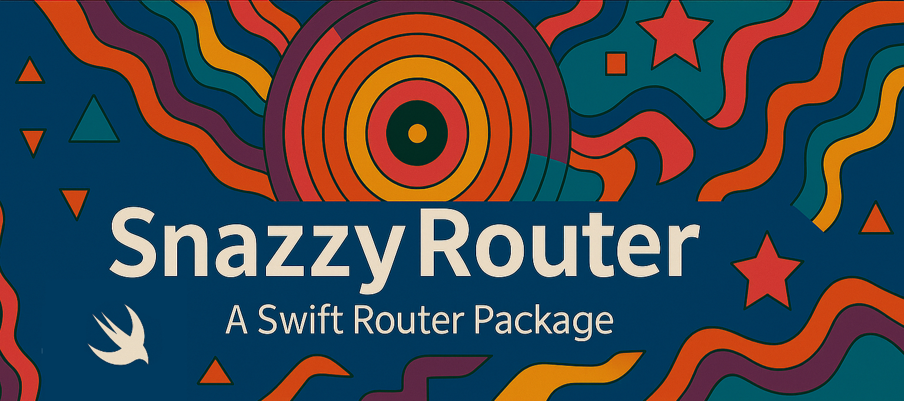

# SnazzyRouter ✨

<p align="center">
  
</p>

<p align="center">
  
  
  
  
</p>


<p align="center">
 
  A modern, type-safe SwiftUI router with a clean declarative API
</p>

## 📦 Installation

### Swift Package Manager

Add SnazzyRouter to your project through Xcode:

1. File → Add Package Dependencies...
2. Enter the package URL: `https://github.com/DubonYaar/SnazzyRouter.git`
3. Click Add Package

Or add it to your `Package.swift`:

```swift
dependencies: [
    .package(url: "https://github.com/DubonYaar/SnazzyRouter.git", from: "1.0.0")
]
```

## 🚀 Quick Start

### 1. Define Your Routes

```swift
import SnazzyRouter
import SwiftUI

enum AppRoute: Routable {
    case home
    case profile(userId: String)
    case settings
    case detail(item: String)
  
    @ViewBuilder
    var view: some View {
        switch self {
        case .home:
            HomeView()
        case .profile(let userId):
            ProfileView(userId: userId)
        case .settings:
            SettingsView()
        case .detail(let item):
            DetailView(item: item)
        }
    }
}
```

### 2. Set Up Your Router

```swift
import SnazzyRouter
import SwiftUI

@main
struct MyApp: App {
    var body: some Scene {
        WindowGroup {
            Router(AppRoute.self) { router in
                VStack {
                    Text("Welcome to SnazzyRouter!")
                        .font(.largeTitle)

                    Button("Go to Profile") {
                        router.push(.profile(userId: "123"))
                    }
                }
                .padding()
            }
        }
    }
}
```

### 3. Navigate from Child Views

```swift
import SnazzyRouter
import SwiftUI

struct ProfileView: View {
    let userId: String
    @Environment(RouterState<AppRoute>.self) var router
  
    var body: some View {
        VStack {
            Text("Profile: \(userId)")
        
            Button("Go to Settings") {
                router.push(.settings)
            }
        
            Button("Back") {
                router.pop()
            }
        
            Button("Back to Home") {
                router.popToRoot()
            }
        }
    }
}
```

## 📱 Modal Presentations

SnazzyRouter supports all SwiftUI modal types:

```swift
import SnazzyRouter
import SwiftUI

struct HomeView: View {
    @Environment(RouterState<AppRoute>.self) var router
  
    var body: some View {
        VStack(spacing: 20) {
            // Sheet
            Button("Show Settings Sheet") {
                router.sheet = RouterModalItem(
                    destination: .settings,
                    dismiss: {
                        print("Settings dismissed")
                    }
                )
            }
        
            // Full Screen Cover
            Button("Show Full Screen") {
                router.fullScreenCover = RouterModalItem(
                    destination: .detail(item: "Important")
                )
            }
        
            // Popover (iPad)
            Button("Show Popover") {
                router.popover = RouterModalItem(
                    destination: .profile(userId: "popover")
                )
            }
        }
    }
}
```

## 🔔 Alerts & Confirmation Dialogs

Built-in support for alerts and confirmation dialogs:

```swift

import SnazzyRouter
import SwiftUI

struct SettingsView: View {
    @Environment(RouterState<AppRoute>.self) var router
  
    var body: some View {
        VStack(spacing: 20) {
            // Simple Alert
            Button("Show Alert") {
                router.showAlert(
                    Alert(
                        title: Text("Hello!"),
                        message: Text("This is a snazzy alert"),
                        dismissButton: .default(Text("OK"))
                    )
                )
            }
        
            // Confirmation Dialog
            Button("Show Options") {
                router.showConfirmationDialog(
                    title: "Choose an Action",
                    message: "What would you like to do?",
                    actions: [
                        DialogAction(title: "Edit") {
                            router.push(.profile(userId: "edit"))
                        },
                        DialogAction(title: "Delete", role: .destructive) {
                            print("Delete tapped")
                        },
                        DialogAction(title: "Cancel", role: .cancel) {
                            print("Cancelled")
                        }
                    ]
                )
            }
        }
    }
}
```

## 🎯 Advanced Usage

### Custom Router State

You can create and manage your own router state:

```swift

import SnazzyRouter
import SwiftUI

@State private var routerState = RouterState<AppRoute>()

var body: some View {
    Router(AppRoute.self, provider: routerState) { router in
        // Your content
    }
}
```

### Programmatic Navigation

Access the router state directly for complex navigation logic:

```swift

import SnazzyRouter
import SwiftUI

class AppViewModel: ObservableObject {
    let router = RouterState<AppRoute>()
  
    func handleDeepLink(url: URL) {
        // Parse URL and navigate
        router.popToRoot()
        router.push(.profile(userId: "deep-link-user"))
    }
}
```

## 📚 Documentation

### Core Types

- **`Routable`** - Protocol for defining navigable destinations
- **`RouterState<D>`** - Observable state container for navigation
- **`Router<D, Content>`** - Main view component for routing
- **`RouterModalItem<D>`** - Modal presentation configuration
- **`DialogAction`** - Action for confirmation dialogs

### Navigation Methods

- `push(_:)` - Navigate to a destination
- `pop()` - Go back one level
- `popToRoot()` - Return to root view
- `showAlert(_:)` - Display an alert
- `showConfirmationDialog(title:message:actions:)` - Show confirmation dialog

### Direct Path Access

You can directly access and manipulate the navigation path:

```swift
@Environment(RouterState<AppRoute>.self) var router

// Read the current navigation path
let currentPath = router.path

// Get the count of destinations in the stack
let stackDepth = router.path.count

// Check if a specific route is in the path
let hasSettings = router.path.contains(.settings)

// Manually set the entire path
router.path = [.home, .profile(userId: "123"), .settings]

// Remove specific items from the path
router.path.removeAll { $0 == .settings }
```

## 🤝 Contributing

Contributions are welcome! Please feel free to submit a Pull Request.

## 📄 License

SnazzyRouter is available under the MIT license. See the LICENSE file for more info.

## 🙏 Acknowledgments

Built with ❤️ using SwiftUI and the power of snazziness.

---

<p align="center">
  <i>Make your navigation snazzy!</i>
</p>
